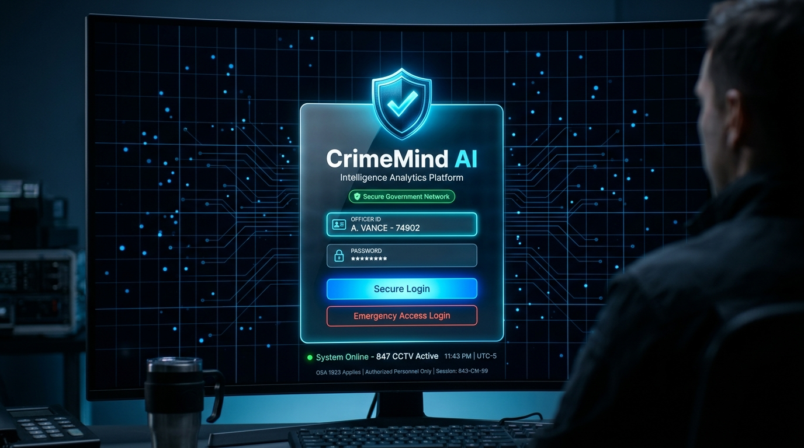
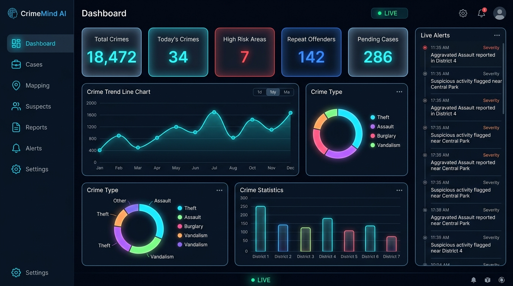
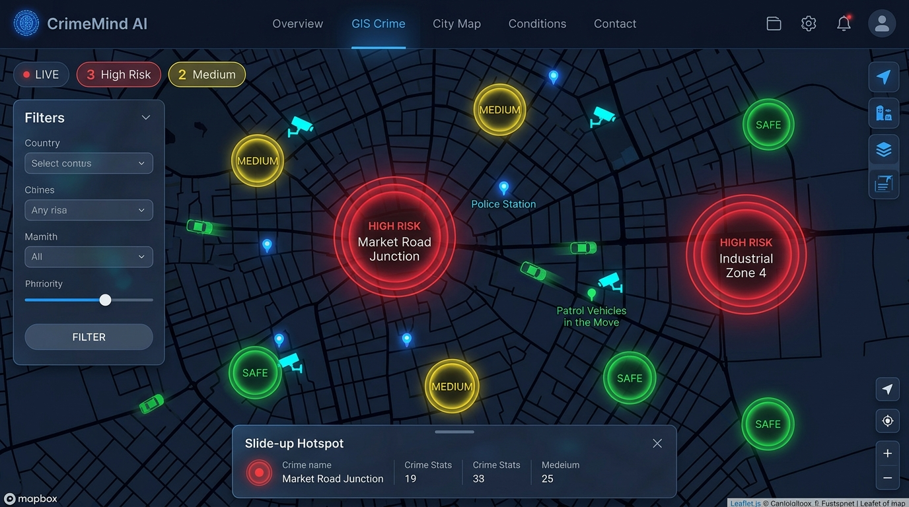
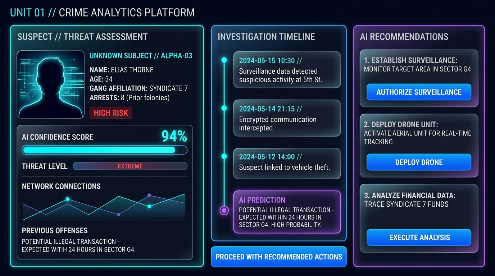
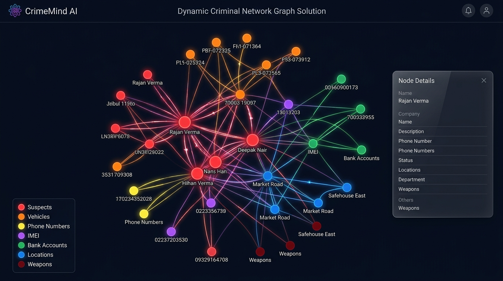
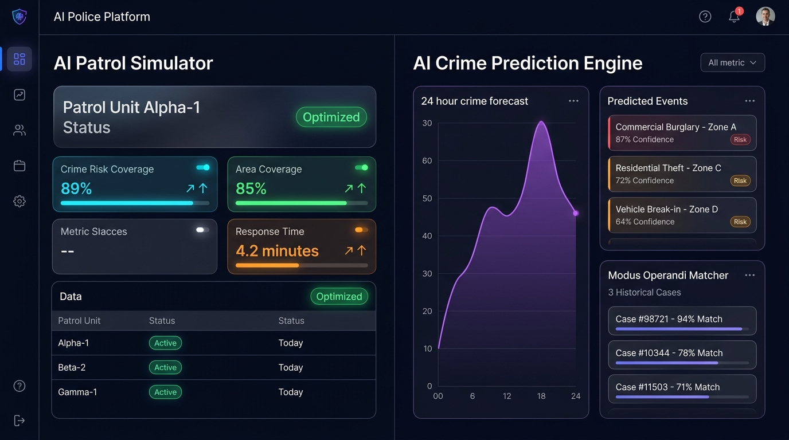

# 🛡️ CrimeMind AI
### *Transforming Crime Data into Actionable Intelligence*

> **A futuristic AI-powered Crime Analytics and Investigation Copilot for police departments.**

[](https://hari2006-coder.github.io/crimemind-ai/)
[](https://github.com/Hari2006-coder/crimemind-ai)
[](https://github.com/Hari2006-coder/crimemind-ai/blob/master/demo/CrimeMind-AI-Demo.mp4)
[](https://github.com/Hari2006-coder/crimemind-ai/tree/master/screenshots)
[](LICENSE)

---

## 🔗 Quick Links

| | Link |
|---|---|
| 🌐 **Live Demo** | https://hari2006-coder.github.io/crimemind-ai/ |
| 📦 **GitHub Repository** | https://github.com/Hari2006-coder/crimemind-ai |
| 🎬 **Demo Video** | https://github.com/Hari2006-coder/crimemind-ai/blob/master/demo/CrimeMind-AI-Demo.mp4 |
| 📸 **Screenshots** | https://github.com/Hari2006-coder/crimemind-ai/tree/master/screenshots |

---

## 🎯 Overview

**CrimeMind AI** is a premium, government-grade AI Crime Analytics platform designed for national and state-level police departments. It combines real-time crime data, predictive AI models, and interactive geospatial mapping into a single unified intelligence dashboard.

Inspired by platforms like **Palantir Gotham**, **IBM Watson**, and **Tesla Dashboard** — built entirely with vanilla web technologies, zero frameworks, zero build step.

---

## ✨ Features

### 10 Full Pages
| Page | Description |
|------|-------------|
| 🔐 **Login** | Animated particle background, emergency access, secure badge |
| 📊 **Dashboard** | 5 live stat cards, trend charts, district comparison, AI insight strip |
| 🗺️ **Live Crime Map** | Leaflet.js GIS map, hotspot circles, CCTV markers, patrol vehicles |
| 🕵️ **AI Investigation Copilot** | Suspect search, AI timeline reconstruction, behavioral profiling |
| 🕸️ **Criminal Network** | D3.js force-directed graph, drag/zoom/pan, relationship mapping |
| 🚔 **AI Patrol Simulator** | Animated route optimizer, before/after coverage metrics |
| 🔮 **AI Crime Prediction** | 24h forecast, modus operandi matcher, social media signals |
| 🌐 **Dark Web Monitor** | Live classified feeds, keyword watchlist, threat intelligence |
| 📄 **Report Generator** | Classified PDF-ready reports, AI-written summaries |
| 🚨 **Alert Center** | Live-injecting alerts, emergency dispatch, filtering |
| ⚙️ **Settings** | Profile, security, notifications, system logs |

### 🚀 Unique AI Features
- **AI Behavioral Profile** — Per-suspect aggression, evasion, loyalty, recidivism scores
- **Modus Operandi Matcher** — Pattern matching against historical crime cases
- **Predictive Policing Engine** — 24-hour crime probability forecasting by zone
- **Social Media Crime Signals** — Cross-platform criminal activity detection
- **Voice Command Interface** — Floating mic FAB for hands-free navigation
- **Dark Web Intelligence** — Real-time TOR/dark web keyword monitoring
- **Global Search (Ctrl+K)** — Fuzzy search across suspects, FIRs, locations
- **Live Alert Simulator** — Real-time alert injection with dispatch actions

---

## 🛠️ Tech Stack

| Layer | Technology |
|-------|------------|
| Structure | Vanilla HTML5 |
| Styling | Vanilla CSS (Glassmorphism, Animations) |
| Logic | Vanilla JavaScript ES6 |
| Charts | [Chart.js](https://chartjs.org) v4 |
| Maps | [Leaflet.js](https://leafletjs.com) + OpenStreetMap |
| Network Graph | [D3.js](https://d3js.org) v7 Force Simulation |
| Icons | Inline SVG (Lucide-style) |
| Fonts | Google Fonts — Space Grotesk + JetBrains Mono |

---

## 🚀 Quick Start

```bash
# Clone the repository
git clone https://github.com/Hari2006-coder/crimemind-ai.git

# Open in browser — NO build step required!
cd crimemind-ai
start index.html  # Windows
open index.html   # macOS
```

Or simply **double-click** `index.html` — it runs entirely in the browser.

**Default Login:** Any credentials work (demo mode)

---

## 🎨 Design System

```css
/* Color Palette */
--bg-void:       #02060f   /* Deep void black */
--accent-cyan:   #00d4ff   /* Primary cyan glow */
--accent-blue:   #1e90ff   /* Blue accent */
--danger:        #ff3b5c   /* High risk / alerts */
--warning:       #ffb020   /* Medium risk */
--success:       #00e676   /* Safe / resolved */

/* Effects */
Glassmorphism: backdrop-filter: blur(20px)
Glow:          box-shadow: 0 0 25px rgba(0,212,255,0.45)
Typography:    Space Grotesk + JetBrains Mono
```

---

## 📁 File Structure

```
crimemind-ai/
├── index.html              # Entry point
├── css/
│   ├── variables.css       # Design tokens
│   ├── base.css            # Reset + animations
│   ├── layout.css          # Sidebar, topbar
│   ├── components.css      # UI components
│   └── pages.css           # Page-specific styles
├── js/
│   ├── data.js             # Mock crime dataset
│   ├── app.js              # Router + app shell
│   ├── dashboard.js        # Charts + stats
│   ├── map.js              # Leaflet GIS map
│   ├── investigation.js    # AI investigation
│   ├── network.js          # D3 network graph
│   ├── patrol.js           # Patrol simulator
│   ├── prediction.js       # AI prediction + dark web
│   ├── reports.js          # Report generator
│   └── alerts.js           # Alert center + settings
├── screenshots/            # 7 UI screenshots
└── demo/
    └── CrimeMind-AI-Demo.mp4   # Full demo video (Git LFS)
```

---

## ⌨️ Keyboard Shortcuts

| Shortcut | Action |
|----------|--------|
| `Ctrl+K` | Open global search |
| Click 🎤 | Activate voice commands |

---

## 🏆 Hackathon Submission

**Project:** CrimeMind AI  
**Category:** AI for Public Safety / GovTech  
**Team:** Solo  
**Event:** Datathon 2026  

---

## 📸 Screenshots

### 🔐 Login Page


### 📊 Main Dashboard


### 🗺️ Live Crime Map


### 🕵️ AI Investigation Copilot


### 🕸️ Criminal Network Graph


### 🚔 AI Patrol Simulator & Prediction Engine


---

## 📜 License

MIT License — Free to use, modify, and distribute.

---

<div align="center">
  <strong>Built with ❤️ for public safety · CrimeMind AI © 2024</strong><br>
  <em>Zero dependencies · Zero build step · 100% browser native</em><br><br>
  <a href="https://hari2006-coder.github.io/crimemind-ai/">🌐 Live Demo</a> ·
  <a href="https://github.com/Hari2006-coder/crimemind-ai/blob/master/demo/CrimeMind-AI-Demo.mp4">🎬 Demo Video</a> ·
  <a href="https://github.com/Hari2006-coder/crimemind-ai/tree/master/screenshots">📸 Screenshots</a>
</div>
